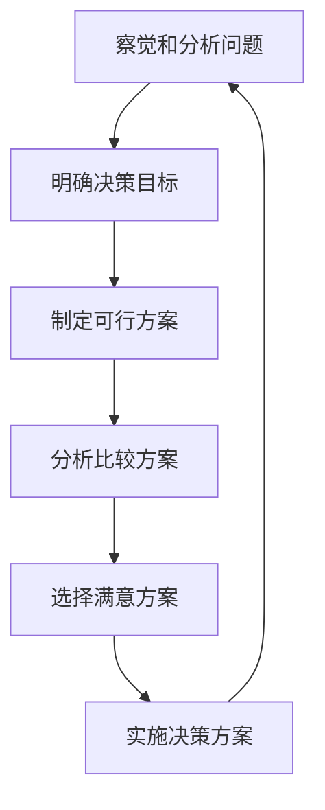

## 决策与决定

科学决策理论认为，决策是为了**实现某一目的**而从**若干个**可行方案中**选择**一个满意方案的**分析判断过程**。

## 科学决策理论的基本观点

- 决策的前提：有明确的目的（问题或目标清楚）
- 决策的条件：有若干个可行的备选方案
- 决策过程：要进行方案分析比较；直到“心中有数”
	- 分析：每个方案的利弊
	- 比较：各个方案的优劣
- 决策的结果：选择满意方案
	- 最优方案既不经济又不现实

决策是管理者从事管理工作的基础。

荐书：《条理化思维》

## 一般组织中的重大决策

重大决策衡量标准：可从问题的重要程度（投入）、影响（涉及的面）的大小、所产生的后果大小（损益）等确定。

一般组织中的重大决策
- 方向和目标决策
- 重大项目、预算和投资决策
- 组织结构调整和关键岗位上的人事决策
- 重要事项的决策程序和规则决策
- 涉及到利益调整等方面的决策

## 理性决策过程

- 决策的科学性主要体现在决策过程的理性化和决策方法的科学化上。
- 决策失误在很大程度上与没有遵循科学的决策过程有关。

> 按照理性的决策过程去做不一定保证决策正确，但是只要决策失误了一定可以在该过程中找到原因。

决策的起点
- 决策的目的或是为了解决某一问题，或是为了达到某一目标。
- 因此，决策的起点是存在某个需要解决的问题。

理性决策的过程

问题判断思路：
1. 是否存在问题——比较应有与实际间的差距
2. 该问题是否需要解决——看差异大小是否在可容忍的范围之内
3. 问题到底是什么——调查分析
4. 问题能够解决——看问题产生原因是否在管理者可控范围之内
5. 谁应对此负责——判断合适人选

决策目标的确定

### 练习案例：合同执行决策

甲乙两家公司，经多次谈判，达成了一个一揽子交易合同，这一合同分六笔交易。在实施合同的过程中，双方遵循以下的市场规则（以出红黑牌为例）
- 六笔交易一笔一笔做，做完一笔再做下一笔；
- 每一次交易双方同事出牌，若双方均为红牌，则各得利润 30 万元，若双方均为黑牌，则双方各亏 20 万元，若一方为红一方为黑，则红方亏 50 万元，黑方得 50 万元，其中第三轮和第六轮损益值加倍；
- 各方每一次出什么牌，由各方董事会集体决策。第一笔须在 15 分钟内完成，整个交易在 45 分钟内完成。

提示：关注每一次决策是如何做出的。

问题的关键：如何让对方出红。
- 我方应出红，让对方感受到我方的诚意
- 应了解对方价值观和为人，看对方是怎样的人
- 加强沟通，向对方表明诚意并陈述利害关系
- 补充违约条款，增加对方违约成本
- 引入第三方公证，增加双方履约保证金条款
- 相互参股，形成利益共同体

风险控制：
- 对方出黑是完全可能的
- 万一对方出黑，我们应将风险控制在我们可承受范围之内
- 根据所确定的风险承受能力，确定相应的对策
- 往理想的结果努力，把风险控制在可承受范围内

> 短期的成效看结果，长期的成效看过程。

## 信息与决策的关系

信息是决策的基础。
分析基于理性的信息，直觉基于潜在的意识：分析 + 直觉=部分 + 整体

## 决策的生理机制

神经管理学：探究决策的生理机制

## 如何提高决策的正确率

- 由“独裁”走向“总裁”——使决策基于群体信息

