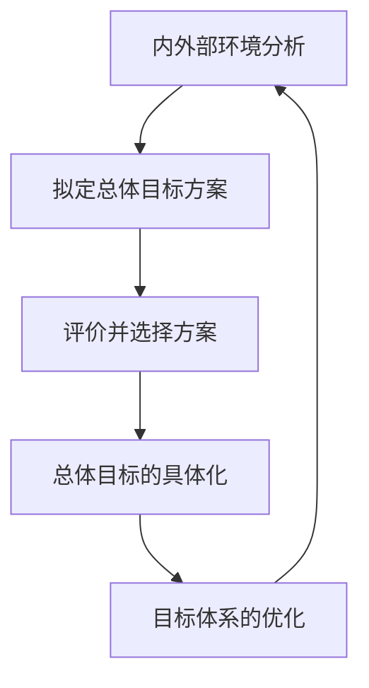

## 目标与目的

目标本身也是一种手段，管理者的重要任务之一就是让目标存在。
目标只是一种管理的手段，目标围绕目的而展开

- 目标之所以重要是因为人和组织的存在都具有一定的目的，而目标正是为了界定和说明这种目的（人生目的或组织宗旨）。
- 目标从本质上而言，也是一种管理手段，管理者的任务之一就是让目标存在。
- 对于组织管理而言，对于目标，最重要的一是清楚明确，二是符合目的，三是随着组织的发展及时提出新目标。

## 目标的重要性

> 眼前应该怎么做，取决于将来要到哪里去。

目标是管理的基本出发点——确立一个清楚正确的目标是科学管理的前提，也是组织开展各项工作的基础。
- 目标提供了决策的准则；
- 目标是一切工作的行动指南；
- 目标是协调岗位、部门之间关系的基础；
- 好的目标能够激励人的内在工作热情；
- 目标达成度是衡量工作好坏的标准。

目标作用小结：
- 目标就是方向——引导我们集中精力；
- 目标就是里程碑——使我们知道自己所处的位置，以及还有多远的路程；
- 目标就是推进剂——可集腋成裘，逐步推进；
- 目标催人奋进——使人们从日常工作的无聊中解脱出来。

## 组织目标的特点

- 差异性。不同的组织有不同的目标追求；
- 多元性。同一组织内有不同性质的多个目标；
- 层次性。目标可分等分层，并通过分解细化转化为具体的行动指南；
- 时间性。任何一个目标都应有明确的时间要求，随着时间的改变应及时提出新的目标。

## 企业目标计划体系的构成

目标体系的构成：
1. 战略
2. 规划
3. 计划

企业的发展目标：
1. 长远目标——企业的发展纲要
2. 中期目标——企业的发展规划
3. 年度目标——年度的经营计划
4. 阶段目标——季度或月度计划

> 企业要制定一个多长时间的目标取决于经营企业的目的。

## 目标的制定过程

1. 内外部环境分析：“想可能”
	- 想——愿景和追求分析
	- 可——外部环境分析
	- 能——内部实力分析

2. 拟定总体目标方案：

3. 评价并选择方案

4. 总体目标的具体化
5. 目标体系的优化
	- 横向协调 ↘
	- 纵向协调  → 相互支持的目标矩阵
	- 综合平衡 ↗

## 目标制定原则

目标的确定原则：
- 以满足社会或市场需求为前提
	- 要把分析社会需求满足社会需求作为制定组织目标的基础。
	- 只有这样，组织才有可能得到社会的承认并取得不断的发展。
- 以提高组织投入产出率为出发点
	- 由于任何组织所拥有的资源都是有限的，所以要充分体现获取最大效益的原则。
	- 即要选择能较好地使有限的资源发挥最大的效益的目标方案。

目标内容的确定
原则一：**价值导向**——组织是一个社会存在体
- 需求分析：有社会价值吗？
- 环境分析：能为社会所接受吗？
原则二：**效益最大化**——组织所拥有的资源是有限的
- 实力分析：我们有实力做吗？
- 竞争力分析：能够比其他人做得更好吗？
- 效益分析：是我们能够做的最好的事情吗？

## 目标值的确定

- 目标值应具有先进性
	- 订立目标是为了实现目标，所以组织目标值的确定必须有切实可行性；
	- 目标订得过高，组织成员的努力无法实现，产生心理挫折；
	- 目标订得过低，失去激励作用，并使社会对组织的需求无法实现。
- 先进目标的制定
	- 拟定原则：基于企业成员的愿望和市场竞争的需要。
	- 合理性判断：通过创新和充分利用社会资源有可能实现。

目标制定要求

## 关联个人目标与组织目标

一旦形成科学管理平台，就可以让组织成员自动自发。

## 目标落实过程

组织目标通过计划工作和组织工作加以落实。

